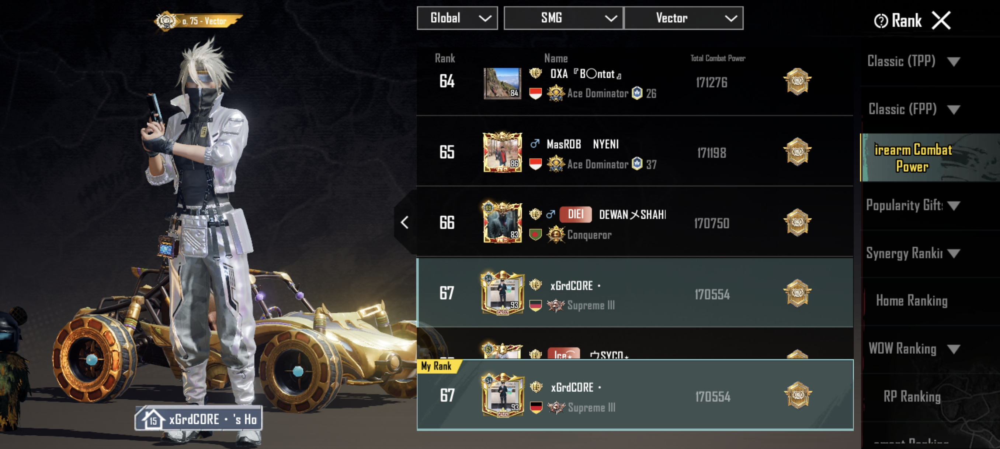

## LEADERBOARD-WEAPON

- This project involves creating a backend system for a real-time leaderboard service. The service will allow users to compete in various games or activities, track their scores, and view their rankings on a leaderboard. The system will feature user authentication, score submission, real-time leaderboard updates, and score history tracking. Redis sorted sets will be used to manage and query the leaderboards efficiently. Also This Project are Based on Case [Roadmap-Golang](hhttps://roadmap.sh/projects/realtime-leaderboard-system).
